# Gravwell Architecture Guide

## Overview

Gravwell is designed as a high-performance, trait-based physics library for
gravity simulation. The architecture emphasizes **zero-cost abstractions**,
**extensibility**, and **dual-mode operation** (game vs. scientific
computing).

## Core Design Principles

1. **Trait-Based Extensibility** - Core functionality defined through traits
2. **Zero-Cost Abstractions** - Compile-time dispatch where possible
3. **SoA Data Layout** - Structure-of-Arrays for SIMD optimization
4. **Dual Performance Modes** - Game (real-time) vs. Science (accuracy)
5. **Minimal Dependencies** - `no_std` core with optional features
6. **Safe by Default** - Leverage Rust's type system for correctness

## High-Level Architecture

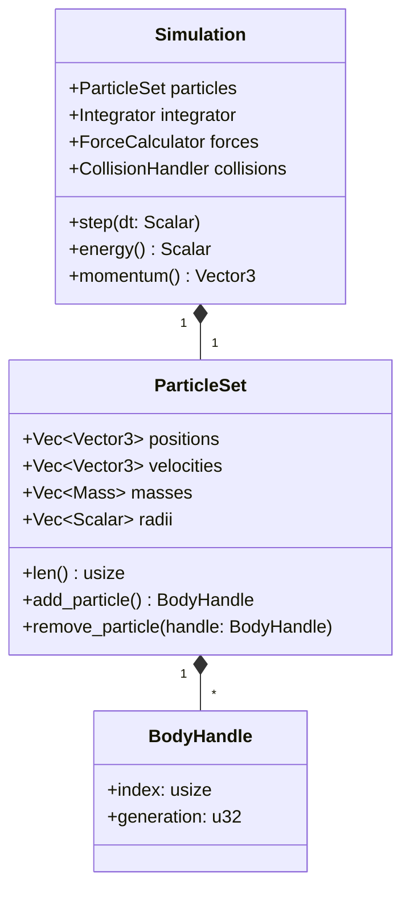

## Core Trait System

The architecture centers around three primary traits that define the physics behavior:

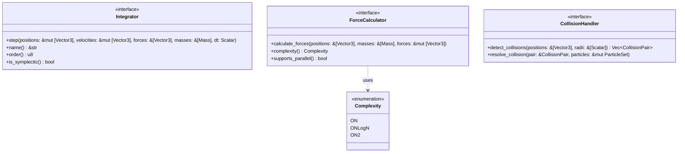

## Integrator Implementations

Different integrators serve different use cases in the dual-mode architecture:

```mermaid
classDiagram
    class Integrator {
        <<interface>>
        +step()
        +is_symplectic() bool
    }

    class SemiImplicitEuler {
        +step()
        +is_symplectic() bool
        -accelerations: Vec~Vector3~
    }
    
    class VelocityVerlet {
        +step()
        +is_symplectic() bool
        -accelerations: Vec~Vector3~
    }

    class Leapfrog {
        +step()
        +is_symplectic() bool
        -half_velocities: Vec~Vector3~
    }

    class RK4 {
        +step()
        +is_symplectic() bool
        -k1: Vec~Vector3~
        -k2: Vec~Vector3~
        -k3: Vec~Vector3~
        -k4: Vec~Vector3~
    }

    class IAS15 {
        +step()
        +is_symplectic() bool
        +set_tolerance(tol: Scalar)
        -adaptive_step_size: Scalar
        -error_estimate: Scalar
    }

    Integrator <|-- SemiImplicitEuler : "Game Mode: Fast & Stable"
    Integrator <|-- VelocityVerlet : "Balanced: Good for both modes"
    Integrator <|-- Leapfrog : "Science Mode: Symplectic"
    Integrator <|-- RK4 : "Science Mode: High accuracy"
    Integrator <|-- IAS15 : "Science Mode: Adaptive precision"
```

## Force Calculation Algorithms

The force calculation system supports multiple algorithms with different computational complexities:

```mermaid
classDiagram
    class ForceCalculator {
        <<interface>>
        +calculate_forces()
        +complexity() Complexity
    }

    class DirectGravity {
        +calculate_forces()
        +complexity() Complexity
        +set_softening(epsilon: Scalar)
        -softening_parameter: Scalar
    }

    class BarnesHut {
        +calculate_forces()
        +complexity() Complexity
        +set_theta(theta: Scalar)
        -theta: Scalar
        -octree: Octree
    }

    class FastMultipole {
        +calculate_forces()
        +complexity() Complexity
        +set_expansion_order(p: usize)
        -expansion_order: usize
        -multipole_tree: MultipoleTree
    }

    class Octree {
        +insert(particle: Particle)
        +calculate_force_on(particle: Particle) Vector3
        -center: Vector3
        -size: Scalar
        -children: [Option~Box~Octree~~; 8]
        -particles: Vec~Particle~
    }

    ForceCalculator <|-- DirectGravity : "O(N²): Small systems"
    ForceCalculator <|-- BarnesHut : "O(N log N): Medium systems"
    ForceCalculator <|-- FastMultipole : "O(N): Large systems"
    BarnesHut "1" *-- "1" Octree
```

## Data Layout Strategy

Gravwell uses Structure-of-Arrays (SoA) for SIMD-friendly data access:

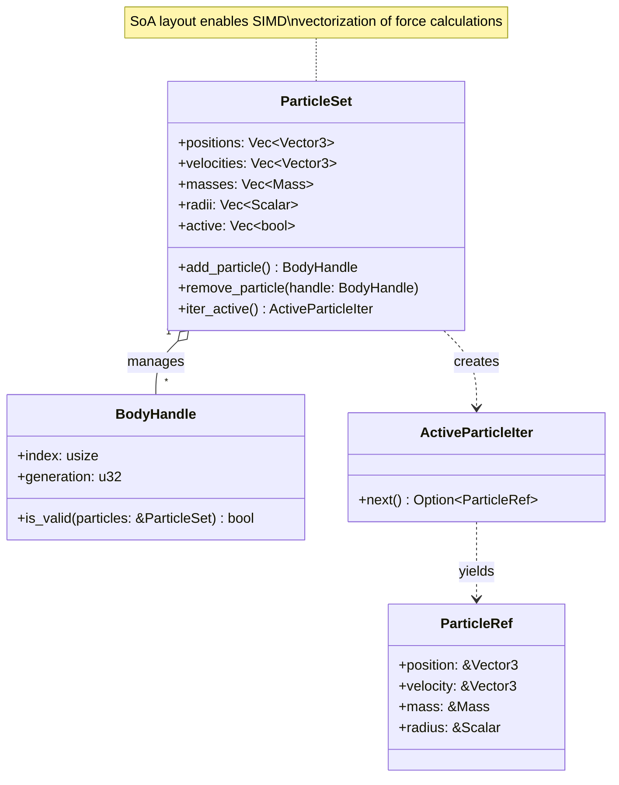

## Performance Optimization Layers

The architecture includes multiple performance optimization layers that can be enabled independently:

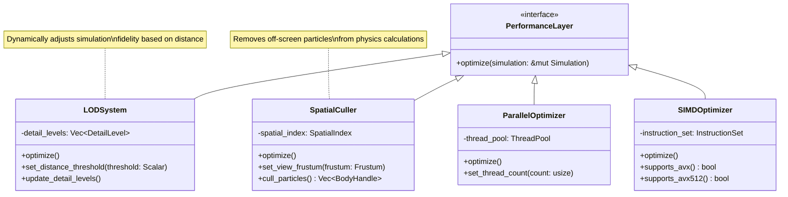

## Error Handling Architecture

Gravwell uses a comprehensive error handling system based on Rust's Result type:

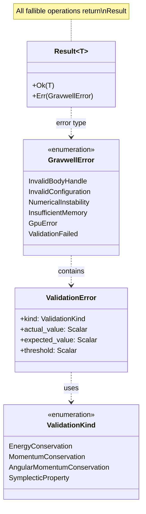

## Builder Pattern Implementation

The simulation is constructed using a type-safe builder pattern:

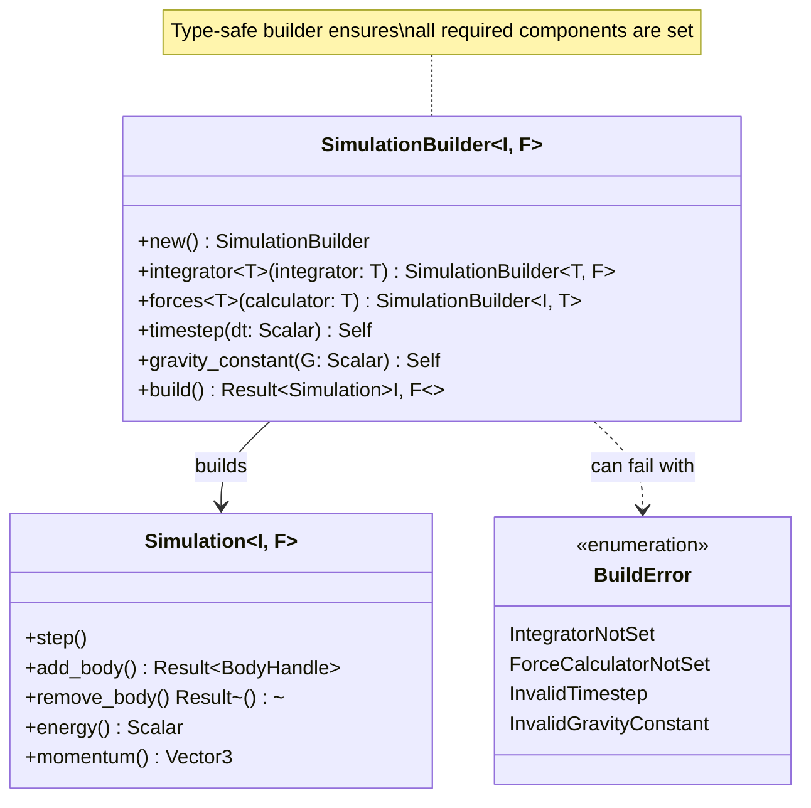

## Memory Management Strategy

Gravwell employs several memory management strategies for optimal performance:

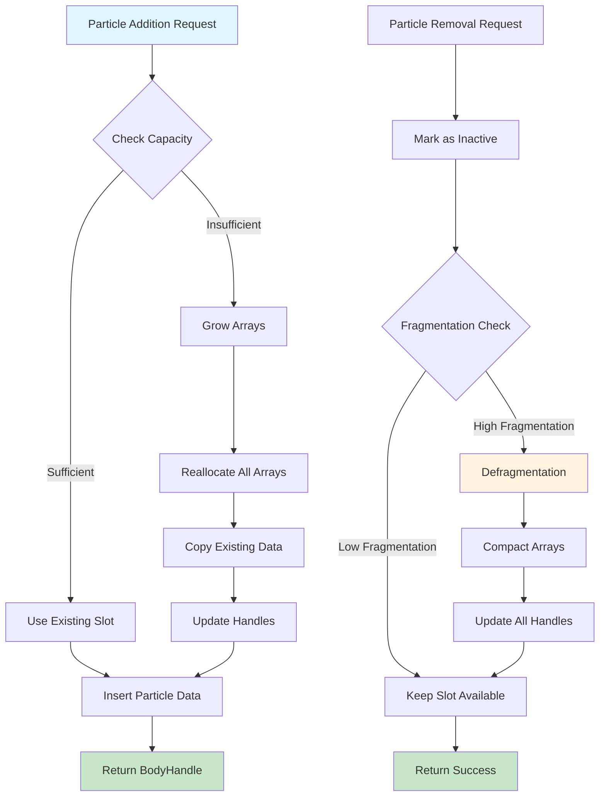

## Integration with Game Engines

The architecture provides clean integration points for game engines:

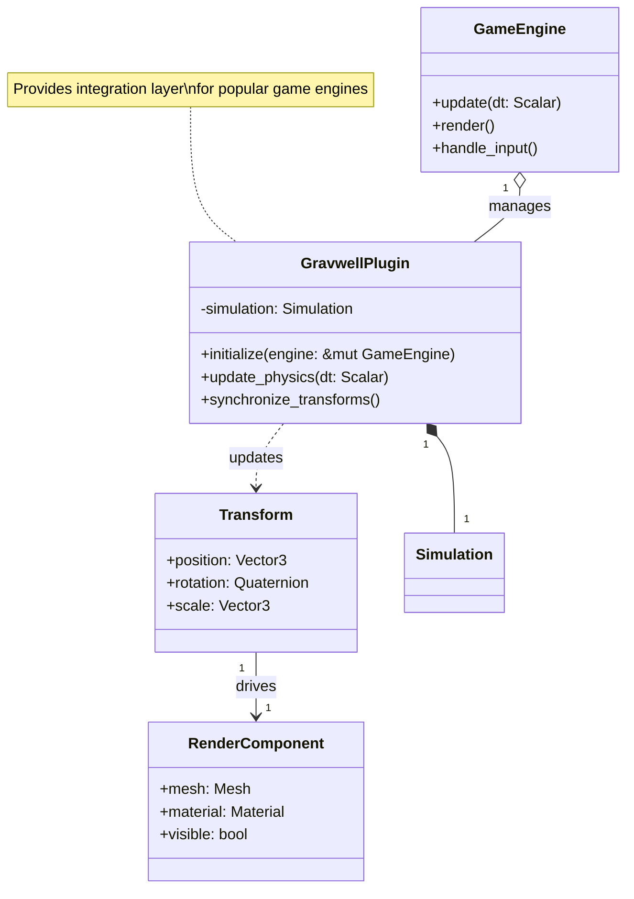

## Scientific Validation Framework

Gravwell includes a comprehensive validation system for scientific accuracy:

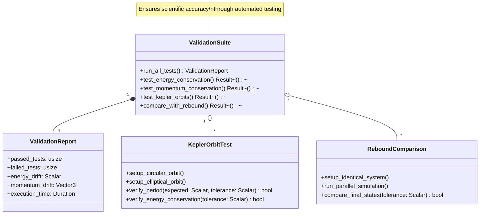

## Module Organization

The crate is organized into logical modules that reflect the architectural layers:

```mermaid
graph TD
    A[lib.rs - Public API] --> B[core/ - Core Abstractions]
    A --> C[integrators/ - Numerical Methods]
    A --> D[forces/ - Force Calculations]
    A --> E[collision/ - Collision Detection]
    A --> F[performance/ - Optimizations]
    A --> G[utils/ - Utilities]

    B --> B1[integrator.rs - Trait Definition]
    B --> B2[forces.rs - Force Calculator Trait]
    B --> B3[particle.rs - Data Structures]
    B --> B4[math.rs - Vector Operations]

    C --> C1[euler.rs - Semi-Implicit Euler]
    C --> C2[verlet.rs - Velocity Verlet]
    C --> C3[leapfrog.rs - Leapfrog]
    C --> C4[rk4.rs - Runge-Kutta 4]
    C --> C5[ias15.rs - IAS15 Adaptive]

    D --> D1[direct.rs - O N squared Direct]
    D --> D2[barnes_hut.rs - O N log N Tree]
    D --> D3[fmm.rs - O N Fast Multipole]

    E --> E1[broad_phase.rs - Spatial Partitioning]
    E --> E2[narrow_phase.rs - Exact Tests]
    E --> E3[response.rs - Collision Response]

    F --> F1[simd.rs - SIMD Optimizations]
    F --> F2[parallel.rs - Multi-threading]
    F --> F3[lod.rs - Level of Detail]
    F --> F4[culling.rs - Spatial Culling]

    G --> G1[constants.rs - Physical Constants]
    G --> G2[validation.rs - Accuracy Testing]
    G --> G3[benchmark.rs - Performance Testing]

    style A fill:#e3f2fd
    style B fill:#f3e5f5
    style C fill:#e8f5e8
    style D fill:#fff3e0
    style E fill:#fce4ec
    style F fill:#f1f8e9
    style G fill:#f5f5f5
```

## Thread Safety and Concurrency

Gravwell is designed with thread safety in mind:

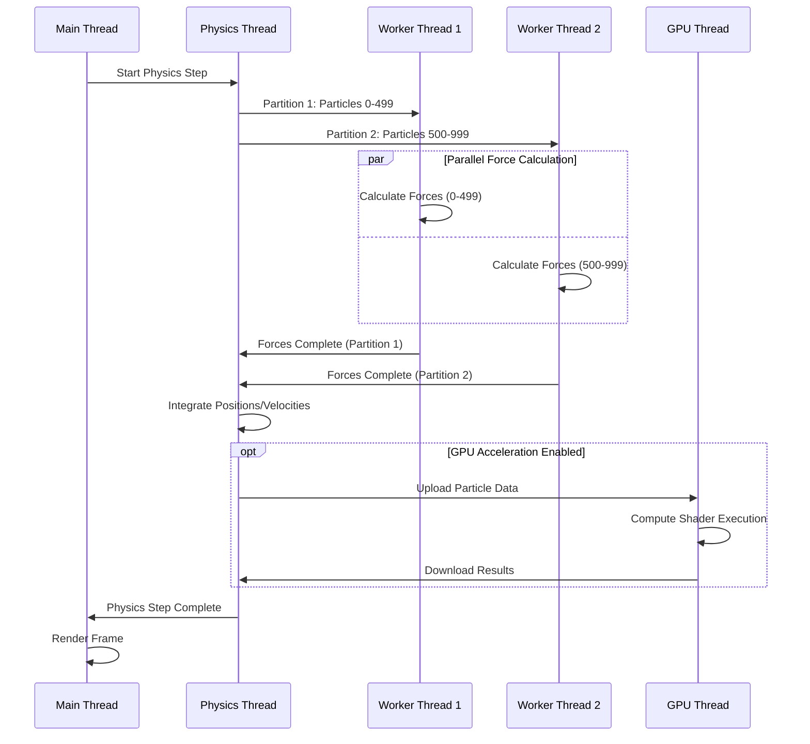

## Performance Characteristics

The architecture is designed to meet specific performance targets:

| Configuration | Target Performance | Hardware Requirements |
|---------------|-------------------|---------------------|
| Game Mode (Basic) | 1,000 particles @ 30 FPS | Single-core CPU |
| Game Mode (Optimized) | 1,000 particles @ 60 FPS | Multi-core CPU + SIMD |
| Science Mode (Basic) | 10,000 particles @ 1 FPS | Single-core CPU |
| Science Mode (Parallel) | 10,000 particles @ 10 FPS | Multi-core CPU |
| Science Mode (GPU) | 100,000 particles @ 1 FPS | Modern GPU |

## Extension Points

The architecture provides several extension points for customization:

1. **Custom Integrators** - Implement the `Integrator` trait
2. **Custom Force Calculators** - Implement the `ForceCalculator` trait  
3. **Custom Collision Handlers** - Implement the `CollisionHandler` trait
4. **Custom Performance Optimizers** - Implement optimization layers
5. **Custom Validation Tests** - Extend the validation framework

This modular design ensures that Gravwell can be adapted to a wide range of
use cases while maintaining performance and scientific accuracy.
